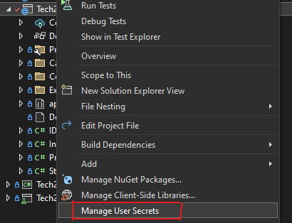

# Tech2023
# NCEA & Cambridge Revision Helper


## Prerequisites
- NET 7 SDK (https://dotnet.microsoft.com/en-us/download/dotnet/7.0)
- SQL Server (https://www.microsoft.com/en-us/sql-server/sql-server-downloads) or a different DB which can be swapped out with some modifications.
- NodeJS (https://nodejs.org/en/download) because both Tailwind & TypeScript depend on it, and it's required for building
- SMTP Server - You could use Outlook as it is default, or any other SMTP server.

## Getting Started
Wherever folder you want the project, open the terminal and run
```
git clone https://github.com/Duo2023/Tech2023.git
```
Open the folder in Visual Studio and double click the solution file Tech2023.sln.

Then in Visual Studio access the user secrets by right clicking on the Tech2023.Web



After that copy in the contents and change the 'FromEmail', 'Username' and 'Password' to your own from your SMTP Server
```jsonc
{
  "EmailOptions": {
    "FromEmail": "example@outlook.com", /* Your own email */
    "Port": 587, /* Default SMTP outlook setting */
    "SenderName": "Tech2023", /* It doesn't really matter what you use */
    "SmtpServer": "smtp-mail.outlook.com", /* Your own SMTP server if you want to use something else */
    "Username": "[outlook-user]", /* Your smtp username */
    "Password": "[outlook-password]" /* Your password */
  }
}
```

## Technologies Used
<p float="left">
  
  
  
</p>

<p float="left">
   
   
   
</p>
